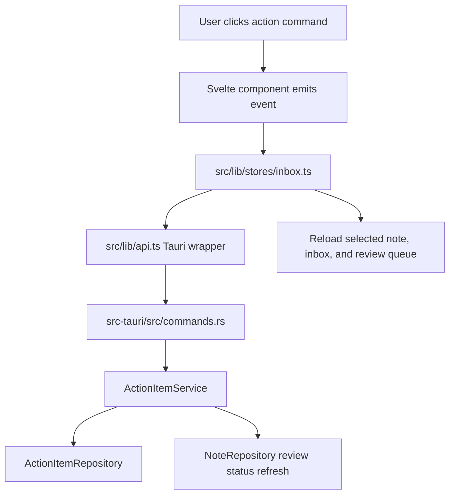

# Action Workflow Design

## Purpose

Work Notes already extracts action items from parsed notes, and the domain model already supports `suggested`, `accepted`, `dismissed`, and `done`. The next development slice should make that lifecycle real across the backend and UI instead of only allowing accept/dismiss.

This feature turns parser suggestions into a usable review workflow:

- Suggested actions can be accepted or dismissed.
- Accepted actions can be completed.
- Completed actions can be reopened to accepted.
- Notes automatically leave `needs_review` when no suggested parser actions remain.
- The existing `ReviewQueue.svelte` surface can be mounted as a real review view fed by backend data.

Raw note text remains untouched. Parser output remains derived data. No action is accepted or completed automatically.

## Scope

In scope:

- Add an `ActionItemService` in `src-tauri/src/services/`.
- Move action lifecycle rules out of direct command-to-repository calls.
- Add Tauri commands for completing and reopening action items.
- Add a backend query for suggested action review rows with note context.
- Wire frontend API and store methods to the new action commands.
- Mount or integrate `ReviewQueue.svelte` so suggested actions can be reviewed without opening every note one at a time.
- Update note review status when suggested actions are resolved.

Out of scope for this slice:

- Creating manual user action items.
- Editing action text, owner, or due date.
- Calendar, task-manager, or notification integration.
- Batch accepting or dismissing every action in a note.
- Changing parser prompts or parser schema.

## Product Behavior

The action workflow has two entry points.

The note detail remains the contextual review surface. A user can inspect the raw note, cleaned note, summary, tags, and actions together, then accept or dismiss suggested actions. Accepted actions appear separately from suggested actions and can be marked done. Done actions stay visible in a subdued completed group and can be reopened.

The review queue is the fast triage surface. It lists suggested actions across notes with enough note context to make a decision: action text, note title, owner, due date, confidence, and capture time. Selecting a queue item opens the related note. Accept and dismiss buttons work directly from the queue.

When the final suggested action for a note is accepted or dismissed, the note review status becomes `reviewed`. If a later parser retry creates new suggested actions, the existing parser result rules can mark the note `needs_review` again.

## Backend Architecture

### `ActionItemService`

Create `src-tauri/src/services/actions.rs`.

Responsibilities:

- Receive typed action IDs from command-layer parsing.
- Set action status according to allowed transitions.
- Refresh the parent note review status after suggestion resolution.
- Provide review queue rows through repository-backed queries.

Allowed lifecycle transitions:

```text
suggested -> accepted
suggested -> dismissed
accepted -> done
done -> accepted
```

The service rejects invalid transitions with `ServiceError::InvalidInput` so UI mistakes do not silently mask state bugs.

### Repository Changes

Extend `ActionItemRepository` with narrowly scoped methods:

- `get(id) -> Option<ActionItem>`
- `set_status(id, status)`
- `list_suggested_with_note_context(limit) -> Vec<ActionReviewItem>`

Extend `NoteRepository` with a review helper:

- `set_review_status(note_id, review_status)`

The service should not duplicate SQL details. It asks repositories for current state and applies the workflow decision.

### Review Status Refresh

After accepting or dismissing a suggested action, `ActionItemService` checks whether the parent note has any remaining `suggested` action items.

- If none remain, set the note to `reviewed`.
- If suggested actions remain, keep the current review status.
- Completing or reopening accepted actions does not by itself change note review status.

This keeps `needs_review` tied to unresolved parser suggestions rather than completed work.

## Command Contract

Existing commands should delegate to `ActionItemService`:

```text
accept_action_item
dismiss_action_item
```

Add commands:

```text
complete_action_item
reopen_action_item
list_suggested_actions
```

`list_suggested_actions` returns camelCase DTOs:

```json
{
  "id": "action-id",
  "noteId": "note-id",
  "noteTitle": "Kiosk 7 telemetry IDs",
  "text": "Bring serial list into the Tuesday sync.",
  "owner": "Maya",
  "dueDate": null,
  "confidence": 0.82,
  "createdAt": "2026-05-20T13:42:00Z"
}
```

The command should default to a practical limit, such as 100 review rows ordered by newest note first. A larger paging model can be added later if the queue becomes too large.

## Frontend Architecture

### Types And API

Add an `ActionReviewItem` type in `src/lib/types.ts`.

Add API wrappers in `src/lib/api.ts`:

- `completeActionItem(actionItemId)`
- `reopenActionItem(actionItemId)`
- `listSuggestedActions()`

The browser fallback should support the same commands so frontend tests and non-Tauri smoke checks remain useful.

### Store

Keep workflow sequencing in `src/lib/stores/inbox.ts`.

Add store state:

- `suggestedActions`
- `loadingSuggestedActions`

Add store methods:

- `loadSuggestedActions`
- `completeAction`
- `reopenAction`

Existing accept/dismiss flows should refresh the selected note, inbox, and suggested action queue. Completion and reopen flows should refresh the selected note and inbox; the suggested queue only needs refresh if a status transition affects queue membership.

### UI

Mount `ReviewQueue.svelte` as the fast action review surface. The first implementation can keep the current main layout and show the queue from the inbox Actions mode or in a right-side/inline area selected by the existing app shell. The important requirement is that the queue is backed by `list_suggested_actions` rather than being a dead component.

Update `NoteDetail.svelte`:

- Accepted actions show a complete control.
- Done actions show a reopen control.
- Suggested actions keep accept and dismiss controls.
- Busy state remains action-specific through `busyActionId`.

Do not turn settings nav labels into separate pages in this slice. The action workflow should land before settings expansion.

## Error Handling

Action status changes are local SQLite writes, so failures should be rare and visible.

- Invalid action IDs return `invalid_input`.
- Missing actions return `not_found`.
- Invalid lifecycle transitions return `invalid_input`.
- Storage failures return `storage_error`.

The frontend should keep the current note selected after action failures and show the existing store error banner. Failed completion or reopen must not mutate frontend state optimistically.

## Data Flow



## Testing

Rust tests:

- `ActionItemService` accepts suggested actions.
- `ActionItemService` dismisses suggested actions.
- `ActionItemService` completes accepted actions.
- `ActionItemService` reopens done actions.
- Invalid lifecycle transitions return invalid input.
- Resolving the final suggested action marks the note `reviewed`.
- Resolving one of several suggested actions keeps the note `needs_review`.
- `list_suggested_actions` returns note title and action metadata ordered by newest note first.
- Command DTOs serialize review queue rows in camelCase.

Frontend tests:

- API fallback handles complete, reopen, and suggested action listing.
- Store refreshes note and inbox after action transitions.
- Store refreshes suggested action queue after accept/dismiss.
- `NoteDetail.svelte` emits complete and reopen events.
- `ReviewQueue.svelte` renders backend-fed action rows and emits select, accept, and dismiss events.

Manual verification:

- Capture a note that produces suggested actions.
- Confirm Actions mode or review queue shows the suggestion.
- Accept one suggestion and verify the note leaves `needs_review` when no suggestions remain.
- Complete an accepted action and verify it moves to Done.
- Reopen a done action and verify it returns to accepted.
- Dismiss a suggestion and verify raw note text remains unchanged.

## Implementation Order

1. Add backend repository methods and service tests.
2. Add `ActionItemService` lifecycle behavior.
3. Update command delegation and add new commands.
4. Add frontend types and API wrappers.
5. Extend store methods and fallback data.
6. Wire `NoteDetail.svelte` complete/reopen controls.
7. Mount `ReviewQueue.svelte` with backend-fed data.
8. Run targeted frontend and Rust tests, then broader checks before handoff.
