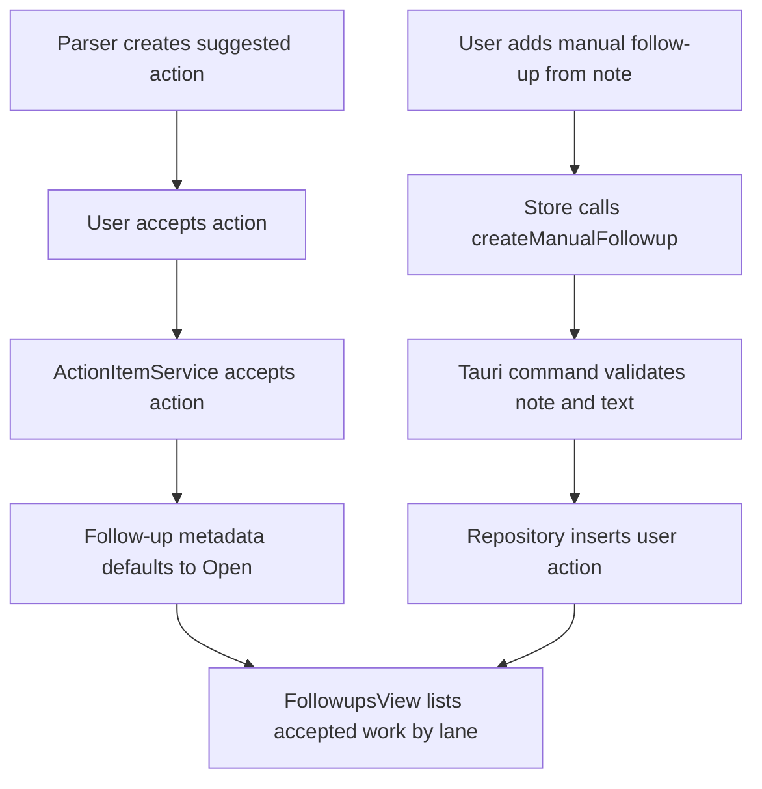

# Follow-ups Board Design

## Purpose

Work Notes already captures raw notes, extracts suggested actions, and lets the user accept, dismiss, complete, and reopen those actions. The missing layer is a durable place to manage accepted work after review.

The Follow-ups board should turn accepted actions into a lightweight work tracker without becoming a generic task app. It keeps the source note as context, groups work by project or topic, and avoids due-date-first planning in the first version.

## Scope

In scope:

- Add a top-level `Follow-ups` primary view.
- Show accepted and user-created follow-ups grouped into project/topic lanes.
- Make accepted parser suggestions appear on the Follow-ups board immediately.
- Add manual follow-up creation from the selected note.
- Default a follow-up lane from the source note's `project` tag first, then `topic`, then `Unsorted`.
- Let the user change a follow-up's lane after creation.
- Support board states: `Open`, `Waiting`, `Blocked`, and `Done`.
- Keep every follow-up linked to a source note.

Out of scope:

- Standalone follow-ups that are not tied to a note.
- Due-date-first board organization.
- Calendar, reminder, or notification behavior.
- Parser prompt or schema changes.
- People alias management.
- Bulk editing or drag-and-drop reordering.

## Product Behavior

`Follow-ups` is a sidebar view alongside Inbox, Today, Actions, People, Archive, and Settings. Selecting it shows project/topic lanes first. Each lane contains compact follow-up rows with the action text, source note title, and current board state.

When the user accepts a suggested parser action, that action becomes a follow-up immediately. The backend assigns it to a lane using the source note tags:

1. First `project` tag on the source note.
2. First `topic` tag if no project tag exists.
3. `Unsorted` if neither exists.

The default board state is `Open`.

Manual follow-up creation starts from the current note detail. The user enters text and optionally chooses a lane. The created follow-up is stored as a user-sourced action linked to that note and appears on the board as `Open`.

The board supports these visible states:

```text
Open
Waiting
Blocked
Done
```

`Open`, `Waiting`, and `Blocked` are board states for active follow-ups. `Done` maps to the existing completed action behavior so completed work remains consistent with Note Detail.

Due dates may still exist on parser-created actions, but the v1 Follow-ups board does not group, sort, or prioritize by due date.

## UI Shape

The Follow-ups view uses a dense operational layout:

- Left/main area: lanes grouped by project or topic.
- Each lane header shows the lane name and active count.
- Each lane contains sections or chips for `Open`, `Waiting`, and `Blocked`.
- Completed work is either collapsed at the bottom of the lane or hidden behind a `Done` filter.
- Selecting a follow-up opens the source note in the existing detail area.

Each follow-up row should show:

- Action text.
- Source note title.
- Board state control for `Open`, `Waiting`, and `Blocked`.
- Lane change control.
- Complete/reopen control.

The design should stay compact and use semantic theme variables only. It should not introduce a marketing-style board or oversized card layout.

## Data Model

Keep parser output unchanged. Parser-created actions still start as `suggested`.

Extend action persistence with follow-up metadata for accepted/user actions:

```text
followup_state: open | waiting | blocked
followup_lane: nullable string override
```

The existing action lifecycle remains:

```text
suggested -> accepted -> done
done -> accepted
suggested -> dismissed
```

Display mapping:

- `status = accepted`, `followup_state = open` => `Open`
- `status = accepted`, `followup_state = waiting` => `Waiting`
- `status = accepted`, `followup_state = blocked` => `Blocked`
- `status = done` => `Done`

Lane resolution:

- Use `followup_lane` when present.
- Otherwise derive from source note tags by project, then topic.
- Otherwise use `Unsorted`.

Manual follow-ups should be stored in `action_items` with `source = "user"`, `status = "accepted"`, and `followup_state = "open"`.

## Backend Architecture

### Repository

Extend `ActionItemRepository` with methods for follow-up board work:

- `list_followups(limit) -> Vec<FollowupItem>`
- `create_manual_followup(note_id, text, lane_override) -> ActionItem`
- `set_followup_state(action_id, state)`
- `set_followup_lane(action_id, lane_override)`

`list_followups` should include note context and tags needed for lane resolution. It should exclude dismissed and suggested actions. It should include completed actions only when the command asks for done items or when the UI needs a done count.

### Service

Add or extend an action/follow-up service in `src-tauri/src/services/`.

Responsibilities:

- Promote accepted suggested actions into follow-ups with default board metadata.
- Create manual note-linked follow-ups.
- Validate board state transitions.
- Validate lane changes.
- Keep source-note context separate from board metadata.
- Treat completion and reopening as existing action lifecycle transitions, not follow-up metadata transitions.

The service should reject:

- Manual follow-up creation without a valid note.
- Empty follow-up text.
- Board state changes for dismissed or suggested actions.
- Lane names that are empty after trimming, unless the caller is explicitly clearing the lane override.

### Commands

Add Tauri commands:

```text
list_followups
create_manual_followup
update_followup_state
update_followup_lane
```

Existing commands continue to handle action lifecycle:

```text
accept_action_item
complete_action_item
reopen_action_item
```

After `accept_action_item`, the accepted action should be visible in `list_followups` with `Open` state.

`update_followup_state` only accepts active board states: `open`, `waiting`, and `blocked`. Moving a follow-up to `Done` uses `complete_action_item`; reopening from `Done` uses `reopen_action_item`.

## Frontend Architecture

### Types And API

Add frontend types:

- `FollowupState = "open" | "waiting" | "blocked" | "done"`
- `FollowupItem`
- `FollowupLane`

Add API wrappers in `src/lib/api.ts`:

- `listFollowups()`
- `createManualFollowup(noteId, text, lane?)`
- `updateFollowupState(actionItemId, state)` for `open`, `waiting`, and `blocked`
- `updateFollowupLane(actionItemId, lane?)`

The browser fallback should support these commands so frontend tests and static smoke checks remain useful.

### Store

Keep workflow sequencing in `src/lib/stores/inbox.ts`.

Add store state:

- `followups`
- `loadingFollowups`

Add store methods:

- `showFollowups`
- `loadFollowups`
- `createFollowupFromSelectedNote`
- `updateFollowupState`
- `updateFollowupLane`

Accepting, completing, reopening, and creating actions should refresh Follow-ups if the current view is Follow-ups, and should not require parsing to complete.

### Components

Create `src/lib/components/FollowupsView.svelte`.

The component should:

- Render project/topic lanes.
- Render compact follow-up rows.
- Emit events for opening the source note, changing state, changing lane, completing, and reopening.
- Avoid owning Tauri calls or persistence behavior.

Update `NoteDetail.svelte` with a manual `Add follow-up` action for the selected note. The component emits the requested text and optional lane; the store owns persistence.

Update `AppShell.svelte` so Follow-ups is a real primary navigation item with an active count.

## Error Handling

Follow-up load failures should use the existing store error surface.

Manual follow-up creation failures should keep the entered text available until the user closes or retries. Failed state or lane changes should not optimistically mutate local rows.

If a source note is archived, its follow-ups should not appear in the default Follow-ups board. Archived-note follow-up behavior can be revisited when archive cleanup grows.

If a lane changes while a filter is active, keep the row visible until the refresh completes, then let the refreshed grouping decide where it belongs.

## Data Flow



## Testing

Rust tests:

- Accepting a suggested action makes it appear in `list_followups`.
- Accepted action defaults to `Open`.
- Lane derives from project tag before topic tag.
- Lane falls back to `Unsorted`.
- Manual follow-up creation requires a valid note and non-empty text.
- Manual follow-up is stored as `source = "user"` and `status = "accepted"`.
- Follow-up state can change between `open`, `waiting`, and `blocked`.
- Completing an accepted follow-up makes it display as `Done`.
- Dismissed and suggested actions do not appear in Follow-ups.

Frontend tests:

- AppShell marks Follow-ups active and emits navigation.
- Store loads Follow-ups and refreshes after relevant action changes.
- FollowupsView groups rows by lane.
- FollowupsView dispatches open-note, state-change, lane-change, complete, and reopen events.
- NoteDetail emits manual follow-up creation events without owning persistence.
- API fallback handles follow-up listing, creation, state changes, and lane changes.

Manual verification:

- Capture a note that produces a suggested action.
- Accept the suggestion and verify it appears in Follow-ups immediately.
- Confirm the lane defaults from project/topic tags.
- Change the lane and verify it moves after refresh.
- Move a follow-up to Waiting and Blocked.
- Complete and reopen a follow-up.
- Create a manual follow-up from a note.
- Verify raw note text remains unchanged throughout.

## Implementation Order

1. Add database migration and repository tests for follow-up metadata.
2. Add service behavior for follow-up listing, manual creation, state change, and lane change.
3. Add Tauri commands and DTOs.
4. Add frontend types, API wrappers, and browser fallback behavior.
5. Extend the workflow store.
6. Add `FollowupsView.svelte` and component tests.
7. Add AppShell navigation and NoteDetail manual follow-up entry.
8. Run targeted tests, then the full verification set before handoff.
