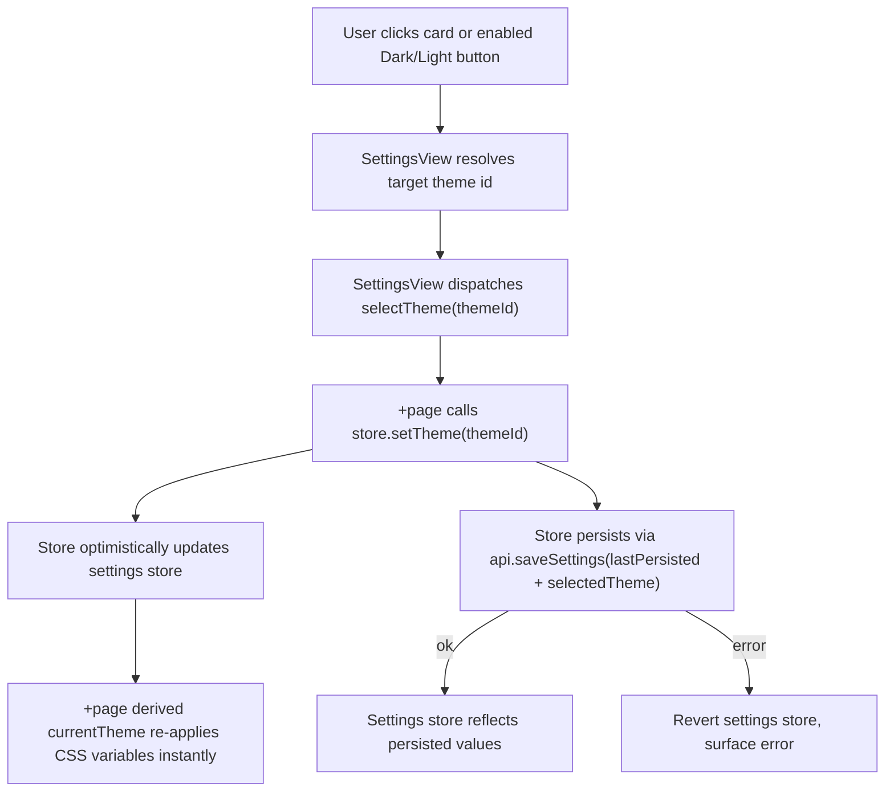

# Appearance Settings: Theme Variants + Everforest Design

## Purpose

The Appearance section of Settings lets the user pick a theme, but two things are weak:

1. Selecting a theme card only stages a local choice; the theme applies across the app only after the user presses **Save**.
2. The theme card preview is a small color-swatch row that does not clearly communicate what the chosen theme looks like in use.

This work makes theme selection apply (and persist) instantly on click, redesigns each card to preview the real UI, adds an Everforest dark/light theme pair, and adds a Dark/Light toggle that switches the selected theme's variant when it provides both — and locks to the only available variant otherwise.

## Scope

In scope:

- Add `family` and `mode` metadata to the existing flat `ThemeDefinition` model.
- Add Everforest Dark and Everforest Light themes (medium contrast).
- Apply and persist a theme immediately when a card or an enabled Dark/Light button is clicked, decoupled from the Save button.
- Redesign each theme card as a mini app mockup (sidebar strip + note card + accent button) rendered in the theme's real colors and current variant.
- Add a global `Dark | Light` segmented toggle that acts on the currently selected theme; lock (disable) the variant the selected theme does not provide.
- Group themes into families in the UI by deriving from `family`; one card per family.

Out of scope:

- Per-theme user-customized colors.
- Following the OS/system dark-light preference automatically.
- Everforest "hard"/"soft" contrast variants (only medium).
- Backend/Rust changes. Persistence reuses the existing `save_settings` command and the `selectedTheme` string field.
- Reworking how the quick-capture window receives the theme beyond what already exists.

## Theme Model

Keep the flat `themes` list. Each variant remains a first-class `ThemeDefinition` with its own id. Persistence is unchanged: `AppSettings.selectedTheme` stays a single theme-id string and `getThemeById` continues to resolve it.

Extend `ThemeDefinition` (in `src/lib/theme/tokens.ts`):

```text
family: string            // groups variants, e.g. "everforest", "dark-compact", "memphis"
mode: "dark" | "light"    // which variant this definition is
```

Existing themes become:

- `dark-compact` => family `dark-compact`, mode `dark`
- `memphis` => family `memphis`, mode `light`

New themes:

- `everforest-dark` => family `everforest`, mode `dark`
- `everforest-light` => family `everforest`, mode `light`

A `ThemeFamily` is derived, never stored:

```text
ThemeFamily {
  family: string
  label: string            // family display name, e.g. "Everforest", "Dark Compact"
  dark?: ThemeDefinition
  light?: ThemeDefinition
}
```

### Pure helpers (`src/lib/theme/families.ts`)

- `groupThemeFamilies(themes): ThemeFamily[]` — group variants by `family`, preserving first-seen family order. Family `label` is the variant label with a trailing ` Dark` or ` Light` removed (so `Everforest Dark` => `Everforest`); single-variant families keep their full variant label (`Dark Compact`, `Memphis '86`).
- `resolveVariant(family, mode): ThemeDefinition` — return `family[mode]` if present, otherwise the family's only available variant.
- `modeOf(themeId): "dark" | "light"` — the mode of a theme id (via `getThemeById`).
- `familyOf(themeId): string` — the family of a theme id (via `getThemeById`).

These are framework-free and unit-tested in isolation.

## Everforest Palettes (medium contrast)

All 13 tokens are populated. Final values are verified for readable text/background contrast during implementation; the table below is the starting palette.

### Everforest Dark (`everforest-dark`, `compact: true`)

```text
app.bg          #232a2e
surface.1       #2d353b
surface.2       #343f44
surface.input   #272e33
border.default  #4f585e
border.strong   #7a8478
text.primary    #d3c6aa
text.muted      #859289
accent.primary  #a7c080
accent.hot      #83c092
status.success  #a7c080
status.warning  #dbbc7f
status.error    #e67e80
```

### Everforest Light (`everforest-light`, `compact: true`)

```text
app.bg          #f2efdf
surface.1       #fdf6e3
surface.2       #efebd4
surface.input   #fffbef
border.default  #ddd8be
border.strong   #a6b0a0
text.primary    #5c6a72
text.muted      #626e66
accent.primary  #5c6b00
accent.hot      #35a77c
status.success  #8da101
status.warning  #dfa000
status.error    #cf2f2b

(Contrast pass: `text.muted`, `accent.primary`, and `status.error` were darkened
from the canonical Everforest medium values so accent buttons, muted text, and
error text clear WCAG AA 4.5:1 against the light surfaces. The accent/muted/error
hues are preserved, just deepened.)
```

## UI Shape

The Appearance section renders, top to bottom:

1. A global `Dark | Light` segmented control.
2. A grid of theme-family cards (one per family).

### Dark/Light toggle

- Acts on the currently selected theme's family.
- If the selected family provides both variants, both buttons are enabled and the button matching the selected variant is active.
- If the selected family provides only one variant, the missing side is disabled (locked); the available side is active.
- Clicking an enabled, non-active button switches the selected theme to that variant and applies/persists it immediately.

### Theme-family cards

Each card is a mini app mockup, not a swatch row:

- A vertical sidebar strip using `surface.1`/`border.default` with a few nav-row marks.
- A note card using `surface.2`/`border.default` containing a title line in `text.primary`, a muted line in `text.muted`, and a small accent button in `accent.primary`.
- Card background uses `app.bg`.
- A footer with the family label and an "In use" indicator when this family is the selected one.

Variant shown in a card:

- A multi-variant family (Everforest) renders in the toggle's current mode.
- A single-variant family always renders in its only variant.

Selecting a card:

- Marks that family selected and applies/persists the resolved variant (`resolveVariant(family, currentMode)`); if the family lacks the current mode, the toggle snaps to the family's available mode.

The layout uses semantic theme CSS variables only. No palette colors are hardcoded in component CSS; card preview colors are injected as inline `--preview-*` custom properties derived from the variant being shown, following the existing `themePreviewStyle` pattern.

## Data Flow

Apply-and-persist is decoupled from the Save button.



Key rules:

- `setTheme` persists by merging the new `selectedTheme` into the **last persisted settings**, not the in-progress form values, so it never commits half-edited hotkey/parser/workspace fields.
- The optimistic settings-store update drives the live re-theme through the existing `+page` derived `currentTheme`, so there is no visible lag before persistence completes.
- On persistence failure, the settings store reverts to its prior value and the existing settings error surface shows the message.
- The Save button continues to govern hotkey, parser, and workspace fields exactly as before.

## Components And Wiring

- `src/lib/theme/tokens.ts`: add `family` and `mode` to `ThemeDefinition`.
- `src/lib/theme/themes.ts`: tag existing themes; add `everforestDarkTheme`, `everforestLightTheme`; export them in `themes`.
- `src/lib/theme/families.ts` (new): pure family grouping/resolution helpers.
- `src/lib/theme/families.test.ts` (new): helper unit tests.
- `src/lib/theme/theme.test.ts`: extend for Everforest presence, modes, token completeness, and id resolution.
- `src/lib/stores/inbox.ts`: add `setTheme(themeId)` with optimistic update + persist-merge + revert-on-error; expose it from the store.
- `src/lib/stores/inbox.test.ts`: cover optimistic apply, persist-from-last-saved, and revert-on-error.
- `src/lib/components/SettingsView.svelte`: derive families, render the Dark/Light toggle with lock behavior, render mini-mockup cards, dispatch `selectTheme`. Keep `selectedTheme` local state synced from `settings` for display.
- `src/lib/components/SettingsView.test.ts`: card click dispatches `selectTheme`; toggle disables the unavailable side; selecting a single-variant family locks the toggle.
- `src/routes/+page.svelte`: handle the new `selectTheme` event by calling `store.setTheme`.

## Error Handling

- Theme persistence failure reverts the optimistic settings-store change and shows the existing settings error message; the previously applied theme remains.
- An unknown or stale persisted theme id falls back to `dark-compact` through the existing `getThemeById` default.
- Family grouping tolerates a family with only one variant; the toggle reflects availability rather than assuming both exist.

## Testing

Pure helper tests (`families.test.ts`):

- `groupThemeFamilies` groups variants under one family and preserves order.
- `resolveVariant` returns the requested mode when present.
- `resolveVariant` falls back to the only available variant when the requested mode is missing.
- `modeOf` / `familyOf` return correct metadata for known ids.

Theme tests (`theme.test.ts`):

- `everforest-dark` and `everforest-light` exist in `themes` with the correct modes and family.
- Each Everforest theme defines all 13 tokens.
- `getThemeById` resolves both new ids; unknown ids still fall back to `dark-compact`.

Store tests (`inbox.test.ts`):

- `setTheme` updates the settings store optimistically so a derived theme would change immediately.
- `setTheme` persists the last-saved settings merged with the new theme id (not dirty form values).
- `setTheme` reverts the settings store and sets an error when `saveSettings` rejects.

Component tests (`SettingsView.test.ts`):

- Clicking a theme-family card dispatches `selectTheme` with the resolved variant id.
- Clicking an enabled Dark/Light button dispatches `selectTheme` with that variant's id.
- When the selected family provides only one variant, the opposite toggle button is disabled.
- The selected family's card shows the "In use" indicator.

Manual verification:

- Open Settings, click Everforest; the whole app re-themes immediately without pressing Save.
- Toggle Light/Dark on Everforest; the app and the Everforest card switch variants.
- Select Dark Compact; the Light button is disabled. Select Memphis '86; the Dark button is disabled.
- Reopen the app; the last-clicked theme is still applied (persisted).
- Edit the hotkey field but do not save, then click a theme; the hotkey edit is not committed.

## Implementation Order

1. Extend `ThemeDefinition` with `family`/`mode`; tag existing themes (tests stay green).
2. Add Everforest dark/light themes; extend `theme.test.ts`.
3. Add pure family helpers and `families.test.ts`.
4. Add `setTheme` to the store with optimistic apply, persist-merge, and revert-on-error; extend `inbox.test.ts`.
5. Redesign the Appearance section: Dark/Light toggle with lock, mini-mockup family cards, `selectTheme` dispatch; extend `SettingsView.test.ts`.
6. Wire the `selectTheme` event in `+page.svelte`.
7. Run targeted tests, then the full frontend suite, then manual verification.
