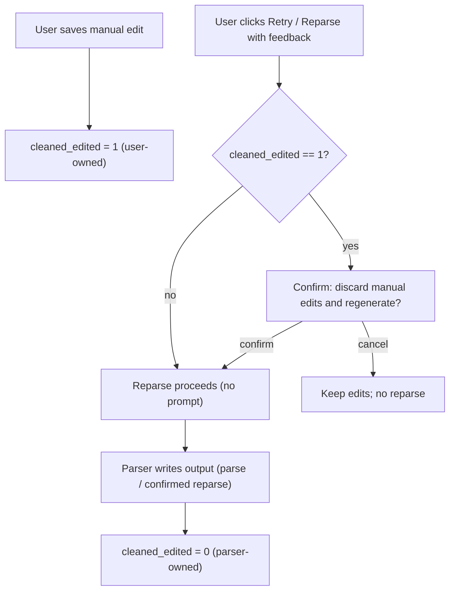

# Edit Cleaned Output — Design

## Purpose

The parser produces a note's cleaned output — `title`, `summary`, and the
`cleanedText` markdown body — and the UI shows it read-only. The user wants to
correct that output by hand. Today there is no edit affordance and no command
to update note content; only the parser writes those fields. Worse, a
successful reparse (`Retry` / `Reparse with feedback`) **unconditionally
overwrites** `title`, `cleaned_text`, and `summary`, so naive editing would be
silently destroyed by the next reparse.

This work lets the user edit the cleaned output (body, title, summary), marks a
note as user-edited when they do, and guards a subsequent reparse behind a
confirmation so manual edits are never lost silently.

## Scope

In scope:

- Edit the cleaned `title`, `summary`, and `cleanedText` body in `NoteDetail`.
- Persist edits through a new Tauri command and repository write.
- A persisted `cleaned_edited` flag on the note (DB migration), set on manual
  save and cleared whenever the parser writes output.
- A UI confirmation before reparsing an edited note; an "edited" indicator.
- Extract the edit form into a focused `CleanedEditor.svelte` component.

Out of scope:

- Editing the raw note (it stays immutable per the existing Trust Rule).
- Rich-text/WYSIWYG editing — the body is edited as raw markdown in a textarea.
- Editing tags or action items (covered by existing accept/dismiss flows).
- Versioning / edit history of cleaned output.
- Backend enforcement of the reparse guard — reparse is always user-initiated
  (the background worker never auto-reparses a parsed note), so the UI
  confirmation fully covers it.

## Data Model

Current `Note` (`src-tauri/src/domain.rs`) has `title: String`,
`cleaned_text: Option<String>`, `summary: Option<String>`, and no edit/source
flag. The `notes` table mirrors this and a `notes_fts` virtual table indexes
`raw_text`, `cleaned_text`, `summary`.

Changes:

- **Migration:** add `cleaned_edited INTEGER NOT NULL DEFAULT 0` to `notes`.
  Existing rows default to `0` (parser-owned).
- **Domain:** add `cleaned_edited: bool` to `Note`; map it from the row.
- **DTO / frontend type:** expose `cleanedEdited: boolean` on the note payload
  the UI receives and on the frontend `Note` type.

Semantics: `cleaned_edited = 1` means the cleaned output is user-owned;
`0` means parser-owned. A manual save sets it to `1`. Every parser write
(first parse or a confirmed reparse-overwrite) sets it back to `0`.

## Ownership and Reparse Flow

Key rules:

- A **failed** reparse never touches the note (the parser applies output only
  on success), so a manual edit survives a failed reparse and the flag stays
  `1`.
- The confirmation is shown only when `cleanedEdited` is true, so ordinary
  parser-owned notes reparse exactly as they do today.

## Backend

### Repository

A new write method on the notes repository, e.g.
`update_cleaned_by_user(id, title, cleaned_text, summary)`:

- `UPDATE notes SET title = ?, cleaned_text = ?, summary = ?, cleaned_edited = 1, updated_at = ? WHERE id = ?`
- refresh the `notes_fts` row for the note (same as the existing apply path).

The parser apply path (`RepositoryParserResultSink::apply_cleaned_text` in
`src-tauri/src/services/parse_queue.rs`) adds `cleaned_edited = 0` to its
`UPDATE`, reclaiming parser ownership on every parser write.

### Service + command

- Service method validating and delegating to the repository: trims `title`
  and substitutes the existing default ("Untitled note" via the title
  normalizer) when empty; stores `cleaned_text` and `summary` as given.
- New Tauri command `update_note_cleaned(note_id, title, cleaned_text, summary)`
  returning the refreshed note, registered in `src-tauri/src/lib.rs` alongside
  the other note commands.

## Frontend

### Components

- **`CleanedEditor.svelte`** (new): a focused editor with `title`, `summary`,
  and `cleanedText` fields (body is a `<textarea>` of raw markdown), plus
  **Save** and **Cancel**. Props: the current title/summary/cleaned values.
  Emits `save` with `{ title, summary, cleanedText }` and `cancel`. No store
  or API access of its own — it is a controlled form, independently testable.
- **`NoteDetail.svelte`** (modify): on the Cleaned view, when `cleanedText`
  exists, show an **Edit** button that mounts `CleanedEditor`; show an
  "edited" indicator when `note.cleanedEdited`; and before dispatching a
  reparse on an edited note, show a confirm dialog (reuse the existing dialog
  pattern already used for "Reparse with feedback").

### API + store

- `api.updateNoteCleaned(noteId, { title, summary, cleanedText })` →
  `invoke("update_note_cleaned", ...)`, with the dev-mode fallback stub like
  the other commands.
- Store action `saveCleanedEdits(note, fields)` following the existing
  **pessimistic** pattern: await the API, then `loadInbox()` and
  `selectedNote.set(await api.getNote(note.id))`. On error, surface the
  existing error path and keep the editor open so edits are not lost.

## Error Handling

- Empty title after trim → the default title (existing normalizer).
- Persistence failure → existing settings/error surface; the editor stays open
  with the user's edits intact (no optimistic clearing).
- Editing is only offered once `cleanedText` exists; a queued/parsing/failed
  note shows no Edit affordance.
- The reparse confirm guards only edited notes; a user can still always reparse
  by confirming.

## Testing

Backend:

- Migration adds `cleaned_edited` with default `0`; existing rows read back `0`.
- `update_cleaned_by_user` writes the three fields, sets `cleaned_edited = 1`,
  bumps `updated_at`, and updates the FTS row (search finds new cleaned text).
- The service trims the title and substitutes the default when empty.
- A successful parser apply sets `cleaned_edited = 0` (a previously edited note
  becomes parser-owned again after a confirmed reparse).
- `update_note_cleaned` command returns the refreshed note with
  `cleanedEdited = true`.

Frontend:

- `CleanedEditor` emits `save` with the edited title/summary/cleanedText and
  `cancel` discards.
- `NoteDetail` shows Edit only when cleaned output exists, shows the "edited"
  indicator when `cleanedEdited`, and shows the reparse confirm only for an
  edited note (and not for a parser-owned note).
- `saveCleanedEdits` calls the API then refreshes inbox and selected note;
  on rejection it surfaces an error and keeps the editor open.

## Implementation Order

1. Migration + domain field + DTO/type exposure.
2. Repository `update_cleaned_by_user` and the parser-apply flag reset; service
   + `update_note_cleaned` command.
3. Frontend `api`/store wiring and the `Note` type field.
4. `CleanedEditor.svelte` and the `NoteDetail` integration (Edit toggle,
   indicator, reparse confirm).
